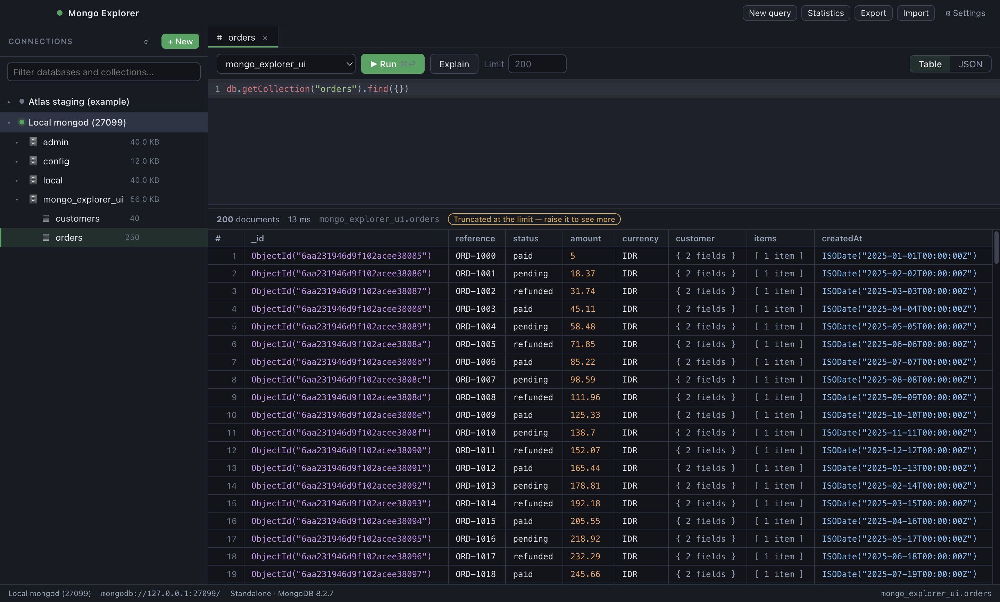
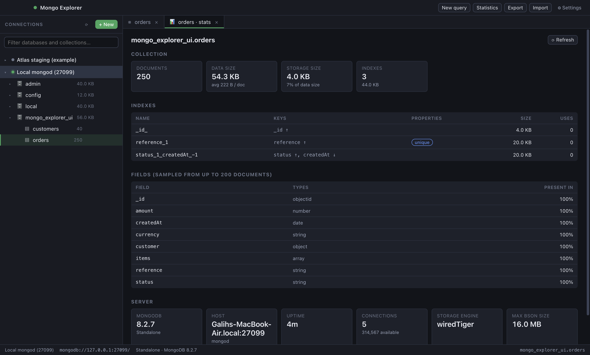
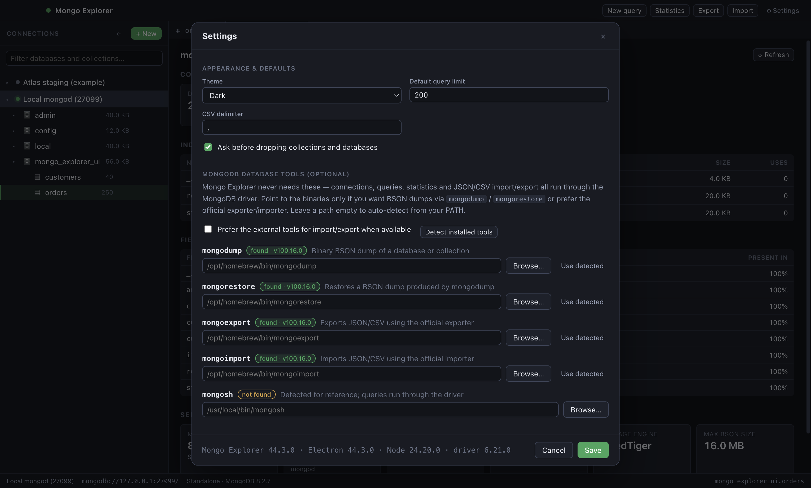

# Mongo Explorer

A cross-platform desktop GUI for MongoDB in the spirit of Studio 3T: save as many
connections as you like, run queries and read the results as a table, inspect
database and collection statistics, and move data in and out of collections.

Everything works **without the MongoDB Database Tools installed** — connections,
queries, statistics and JSON/NDJSON/CSV import & export all go through the
official Node.js driver. `mongodump`, `mongorestore`, `mongoexport` and
`mongoimport` are strictly optional: if you want BSON dumps or prefer the
official binaries, point the app at them in **Settings → MongoDB Database
Tools** (or let it auto-detect them from your `PATH`).



## Features

**Connections**
- Unlimited saved connections, each with its own host list, credentials, replica
  set, read preference, timeouts and TLS settings.
- Connection-string mode or individual-field mode, including `mongodb+srv`.
- Passwords are encrypted with the OS keychain (Keychain on macOS, DPAPI on
  Windows, libsecret on Linux) and stored apart from the connection file. If the
  OS offers no encryption the app refuses to save the password rather than
  writing it in plaintext.
- Test a connection before saving; connect to several deployments at once.

**Querying**
- mongosh-flavoured editor: `db.orders.find({ status: "paid" }).sort({ createdAt: -1 })`,
  `db.orders.aggregate([...])`, `countDocuments`, `updateMany`, `distinct`, and
  helpers such as `ObjectId()`, `ISODate()`, `NumberDecimal()` and `UUID()`
  (with or without `new`).
- Multi-statement scripts with `await` and an explicit `return`.
- Results as a typed table (double-click a cell or row to inspect the document)
  or as raw extended JSON, plus `Explain` for the execution plan.
- Row limit per tab, with a clear badge when the result was truncated.

**Statistics**



- Server: version, topology, host, uptime, connections, storage engine.
- Database: collection/view/object counts, data, storage and index sizes, and a
  per-collection breakdown sorted by size.
- Collection: document count, average document size, storage, index list with
  keys, uniqueness, TTL, size and usage counters, plus a sampled field profile
  showing which fields exist and in what share of documents.

**Import & export**
- Export a collection to a JSON array, NDJSON or CSV with an optional filter,
  projection, sort, skip and limit. Relaxed or canonical extended JSON; CSV
  columns are derived from a sample or specified by hand, and nested fields
  become dot-paths.
- Import JSON arrays, NDJSON or CSV (auto-detected from the file), streamed in
  batches so multi-gigabyte files do not have to fit in memory. Insert, merge or
  replace on a chosen match key, optionally dropping the collection first.
- Optional external-tool routes: `mongodump`/`mongorestore` for BSON dumps and
  `mongoexport`/`mongoimport` if you prefer them. Their output is streamed into
  the dialog's log panel.



## Requirements

- Node.js 20 or newer (only to build; the packaged app is self-contained).
- A reachable MongoDB deployment (4.4+ recommended).

## Getting started

```bash
npm install
npm run dev
```

`npm run dev` starts the Vite dev server for the renderer, rebuilds the main and
preload bundles on change, and launches Electron against them.

## Building distributables

```bash
npm run icon        # regenerate build/icon.png (already committed)
npm run dist:mac    # .dmg + .zip  (arm64 + x64)
npm run dist:win    # NSIS installer + portable .exe
npm run dist:linux  # AppImage + .deb + .tar.gz
```

Installers land in `release/`. Each platform must be built on its own OS (or in
CI); the included GitHub Actions workflow in `.github/workflows/build.yml` builds
all three on every push and uploads the installers as artifacts.

macOS builds are unsigned by default. To sign and notarise, set
`CSC_LINK`/`CSC_KEY_PASSWORD` and the notarisation credentials before running
`npm run dist:mac`.

## Verifying

```bash
npm run typecheck   # renderer and main process
npm run smoke       # end-to-end services test against a real mongod
npm run ui-check    # boots the real UI, clicks through it, writes screenshots
```

Both `smoke` and `ui-check` expect a throwaway server on port 27099:

```bash
mkdir -p /tmp/mongoexp-test/db
mongod --dbpath /tmp/mongoexp-test/db --port 27099
```

The smoke test covers query execution and serialization, cursor limits, shell
helpers, statistics, every import/export format, CSV quoting edge cases,
duplicate-key handling, the external-tool integration and secret storage.
`ui-check` writes screenshots to `artifacts/` and fails on any renderer console
error.

## Project layout

```
electron/            main process
  main.ts            window, menu, lifecycle
  ipc.ts             every IPC handler, each returning a Result envelope
  services/
    store.ts         connection/settings files + OS-encrypted secret vault
    connections.ts   connection CRUD, URI building, client options
    pool.ts          live MongoClients and server info
    query.ts         query evaluation and result shaping
    stats.ts         database/collection/index statistics
    transfer.ts      native streaming import & export
    tools.ts         optional MongoDB Database Tools detection and execution
    csv.ts           CSV encode/parse and document flattening
    bsonEval.ts      shell-style BSON helpers for user-supplied expressions
electron/preload.ts  the only renderer↔main bridge (context isolation is on)
shared/types.ts      types shared by both processes
src/                 React renderer
scripts/             build, dev, icon, smoke and UI-check harnesses
```

## Security notes

- The renderer runs with `contextIsolation: true` and `nodeIntegration: false`;
  it can only reach the API surface declared in `shared/types.ts`.
- A content security policy blocks remote scripts, and external links open in
  the system browser.
- Query code runs in the main process (it needs the driver), with `require`,
  `process`, `module` and the other Node globals shadowed. Treat the editor with
  the same trust you would give a `mongosh` session: do not paste code you have
  not read.
- Passwords never appear in logs; connection strings are redacted before being
  shown or passed to external tools.
