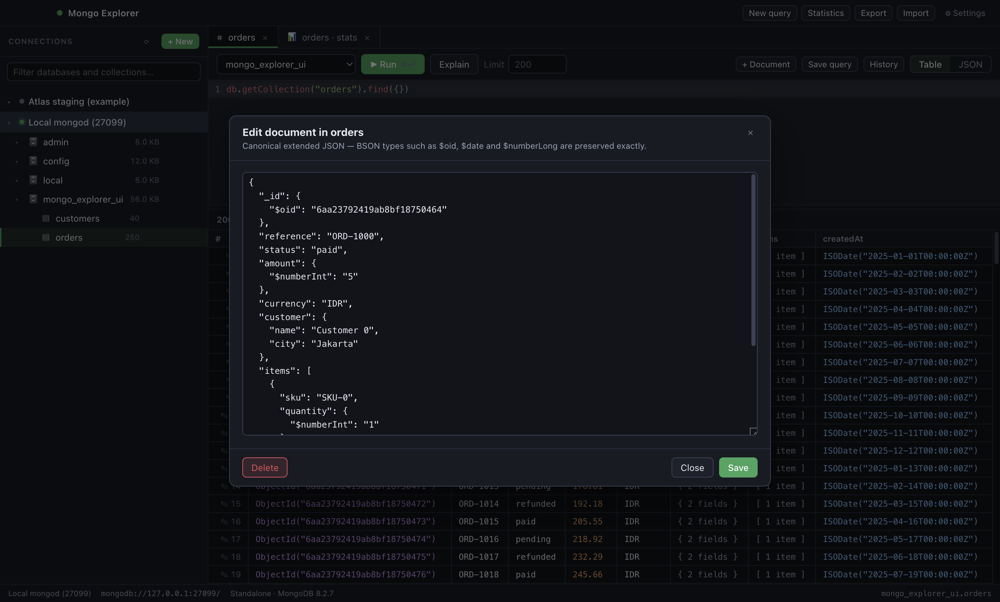

# Mongo Explorer

A cross-platform desktop GUI for MongoDB in the spirit of Studio 3T: save as many
connections as you like, run queries and read the results as a table, inspect
database and collection statistics, and move data in and out of collections.

Everything works **without the MongoDB Database Tools installed** — connections,
queries, statistics and JSON/NDJSON/CSV import & export all go through the
official Node.js driver. `mongodump`, `mongorestore`, `mongoexport` and
`mongoimport` are strictly optional: if you want BSON dumps or prefer the
official binaries, point the app at them in **Settings → MongoDB Database
Tools** (or let it auto-detect them from your `PATH`).


## Features

**Connections**
- Unlimited saved connections, each with its own host list, credentials, replica
  set, read preference, timeouts and TLS settings.
- Connection-string mode or individual-field mode, including `mongodb+srv`.
- Passwords are encrypted with the OS keychain (Keychain on macOS, DPAPI on
  Windows, libsecret on Linux) and stored apart from the connection file. If the
  OS offers no encryption the app refuses to save the password rather than
  writing it in plaintext.
- Test a connection before saving; connect to several deployments at once.

**Querying**
- mongosh-flavoured editor: `db.orders.find({ status: "paid" }).sort({ createdAt: -1 })`,
  `db.orders.aggregate([...])`, `countDocuments`, `updateMany`, `distinct`, and
  helpers such as `ObjectId()`, `ISODate()`, `NumberDecimal()` and `UUID()`
  (with or without `new`).
- Multi-statement scripts with `await` and an explicit `return`.
- Results as a typed table (double-click a nested value to inspect it) or as raw
  extended JSON, plus `Explain` for the execution plan.
- Row limit per tab, with a clear badge when the result was truncated.
- Every run is recorded in a searchable history (consecutive identical runs
  collapse into one), and any query can be saved under a name and reopened
  later from the same library.

**Editing**



- Edit a cell in place: double-click it (or select it and press Enter), type, and
  press Enter to write just that field with `$set`. Tab moves to the next cell,
  Escape cancels. The field keeps the BSON type it already had — a whole number
  typed into a `double` stays a double, an `ObjectId` stays an `ObjectId` — and
  only the edited cell repaints, so the query is not re-run.
- Right-click a row for the rest: edit the document as JSON, view or copy it,
  copy a value or the `_id`, filter the query by the clicked value, set a field
  to null or unset it, duplicate the document, or delete it.
- Edit a whole document from the result table: click the row number to open it in
  canonical extended JSON, so an edit round-trip cannot turn an `int64` into a
  double. Changing `_id` is refused rather than silently ignored.
- Insert new documents into the current collection and delete existing ones.
- Create indexes with keys, name, uniqueness, sparseness, TTL, a partial filter
  expression and a collation; drop any index except `_id_`.
- Create a database from the connection row, or a collection from the database
  row. MongoDB has no standalone create-database command — a database begins to
  exist once it holds a collection — so the dialog asks for both names at once.
  Drop a database or a collection from the same rows, behind a confirmation.

**Statistics**


- Server: version, topology, host, uptime, connections, storage engine.
- Database: collection/view/object counts, data, storage and index sizes, and a
  per-collection breakdown sorted by size.
- Collection: document count, average document size, storage, index list with
  keys, uniqueness, TTL, size and usage counters, plus a sampled field profile
  showing which fields exist and in what share of documents.

**Import & export**
- Export a collection to a JSON array, NDJSON or CSV with an optional filter,
  projection, sort, skip and limit. Relaxed or canonical extended JSON; CSV
  columns are derived from a sample or specified by hand, and nested fields
  become dot-paths.
- Import JSON arrays, NDJSON or CSV (auto-detected from the file), streamed in
  batches so multi-gigabyte files do not have to fit in memory. Insert, merge or
  replace on a chosen match key, optionally dropping the collection first.
- Optional external-tool routes: `mongodump`/`mongorestore` for BSON dumps and
  `mongoexport`/`mongoimport` if you prefer them. Their output is streamed into
  the dialog's log panel.
- A long transfer shows a progress bar with the share done, the documents or
  bytes covered, how long it has been running, the current rate and roughly how
  much longer it needs. Exports divide by a counted total, imports by the size
  of the file, and the external tools by the progress they print; a job nobody
  can measure gets a moving bar rather than a fake percentage.
- **Stop** ends a running transfer without closing the app, and says what it
  left behind. Close the dialog and the status bar keeps the bar, the percentage
  and the clock until the job ends.

**Telling you what happened**
- A finished operation confirms itself with a small toast in the corner that
  fades on its own — no OS notifications, nothing to dismiss.
- A failed one stops you with a dialog naming the operation and quoting the
  reason underneath, because a failure you can scroll past is worse than none.
  Even a promise nobody caught ends up there rather than only in the console.


## Requirements

- Node.js 20 or newer (only to build; the packaged app is self-contained).
- A reachable MongoDB deployment (4.4+ recommended).

## Getting started

```bash
npm install
npm run dev
```

`npm run dev` starts the Vite dev server for the renderer, rebuilds the main and
preload bundles on change, and launches Electron against them.

## Building distributables

```bash
npm run icon        # regenerate build/icon.png (already committed)
npm run dist:mac    # .dmg + .zip  (arm64 + x64)
npm run dist:win    # NSIS installer + portable .exe
npm run dist:linux  # AppImage + .deb + .tar.gz
```

Installers land in `release/`. Each platform must be built on its own OS, or in
CI: `.github/workflows/build.yml` builds all three on every pull request and
uploads the installers as artifacts.

## Releases

Every push to `main` publishes a GitHub Release, via
`.github/workflows/release.yml`:

1. **verify** — typecheck, build and the smoke suite against a real MongoDB.
2. **version** — bumps the patch version, commits it back to `main` as
   `chore: release vX.Y.Z [skip ci]` and pushes the tag. Nothing is released if
   verification failed.
3. **package** — macOS, Linux and Windows build in parallel from that tag and
   upload their installers into a single draft release.
4. **publish** — flips the draft to the latest release, with notes listing every
   commit since the previous tag.

The bump is pushed with `GITHUB_TOKEN`, which by design does not trigger another
run, so releases cannot loop. For a MINOR or MAJOR release, bump the version
yourself (`npm version minor --no-git-tag-version`) and push; the next patch bump
continues from there.

macOS builds are unsigned by default. To sign and notarise, set
`CSC_LINK`/`CSC_KEY_PASSWORD` and the notarisation credentials before running
`npm run dist:mac`.

## Verifying

```bash
npm run typecheck   # renderer and main process
npm run smoke       # end-to-end services test against a real mongod
npm run ui-check    # boots the real UI, clicks through it, writes screenshots
```

Both harnesses start a throwaway `mongod` on port 27099 and shut it down
afterwards; if something is already listening there they reuse it instead. Set
`MONGO_TEST_PORT` to move it, or start your own server beforehand if `mongod` is
not on your `PATH`.

The smoke test's 47 checks cover query execution and serialization, cursor
limits, shell helpers, statistics, index creation and dropping, document
editing with BSON-type preservation, query history and saved queries, every
import/export format, CSV quoting edge cases, duplicate-key handling, the
external-tool integration and secret storage. `ui-check` clicks through the real
UI, writes screenshots to `artifacts/`, and fails on any renderer console error.

## Project layout

```
electron/            main process
  main.ts            window, menu, lifecycle
  ipc.ts             every IPC handler, each returning a Result envelope
  services/
    store.ts         connection/settings files + OS-encrypted secret vault
    connections.ts   connection CRUD, URI building, client options
    pool.ts          live MongoClients and server info
    query.ts         query evaluation and result shaping
    stats.ts         statistics, index management, document editing
    library.ts       query history and saved queries
    transfer.ts      native streaming import & export
    tools.ts         optional MongoDB Database Tools detection and execution
    csv.ts           CSV encode/parse and document flattening
    bsonEval.ts      shell-style BSON helpers for user-supplied expressions
electron/preload.ts  the only renderer↔main bridge (context isolation is on)
shared/types.ts      types shared by both processes
src/                 React renderer
scripts/             build, dev, icon, mongod, smoke and UI-check harnesses
```

## Security notes

- The renderer runs with `contextIsolation: true` and `nodeIntegration: false`;
  it can only reach the API surface declared in `shared/types.ts`.
- A content security policy blocks remote scripts, and external links open in
  the system browser.
- Query code runs in the main process (it needs the driver), with `require`,
  `process`, `module` and the other Node globals shadowed. Treat the editor with
  the same trust you would give a `mongosh` session: do not paste code you have
  not read.
- Passwords never appear in logs; connection strings are redacted before being
  shown or passed to external tools.
